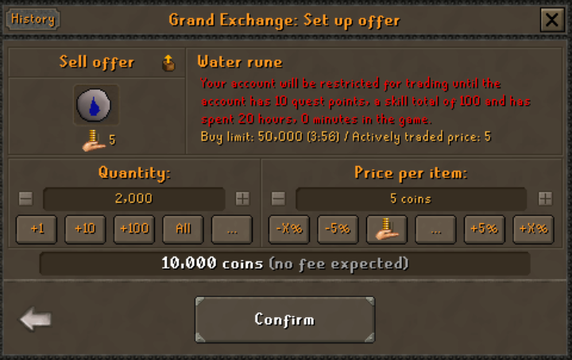
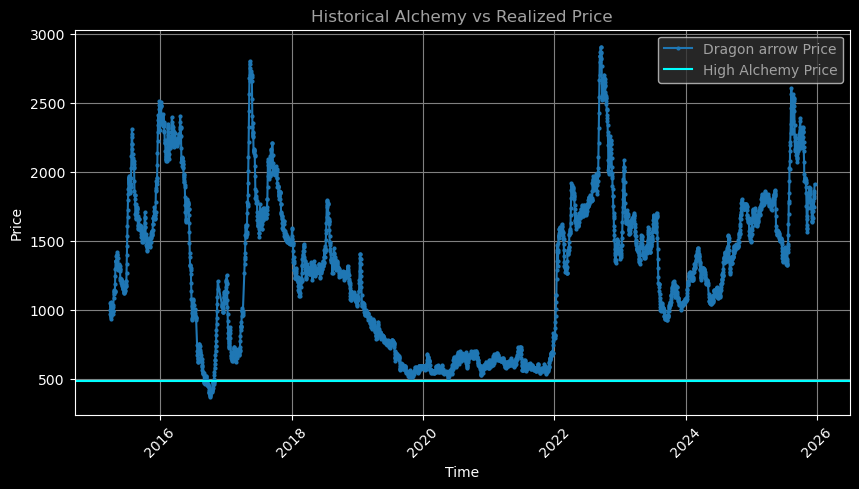
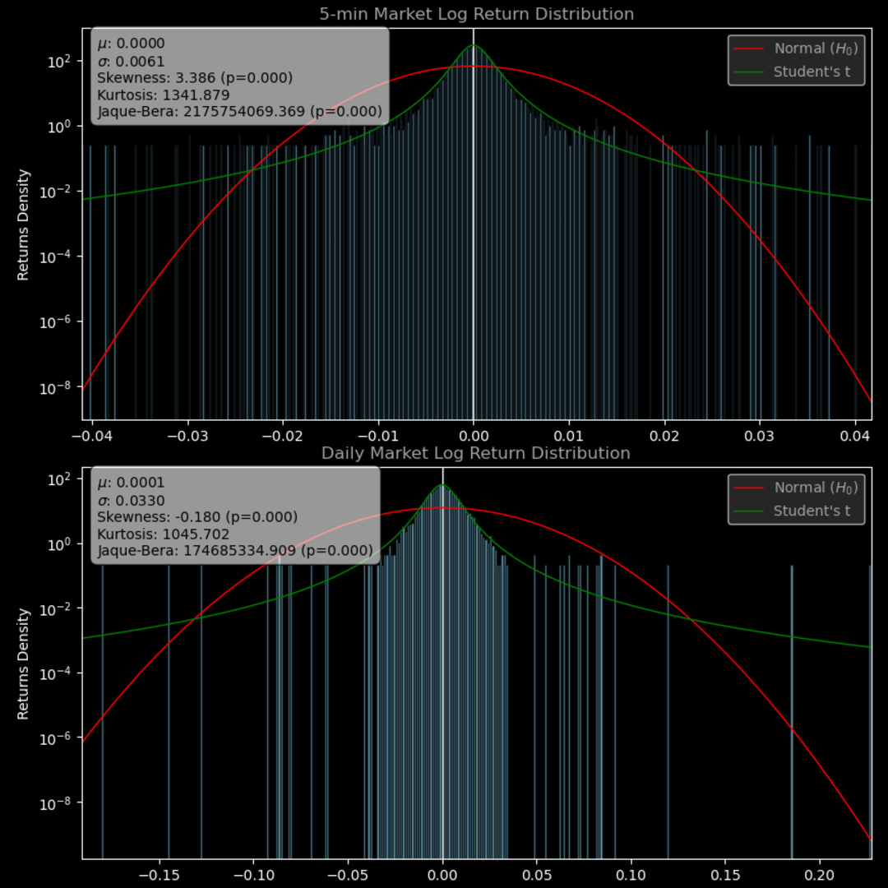
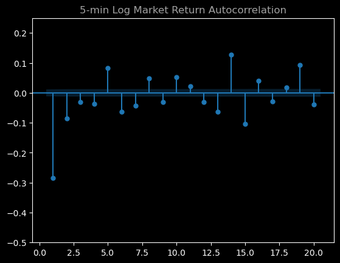
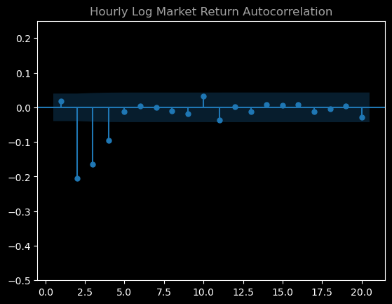
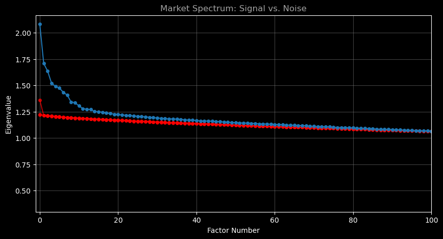
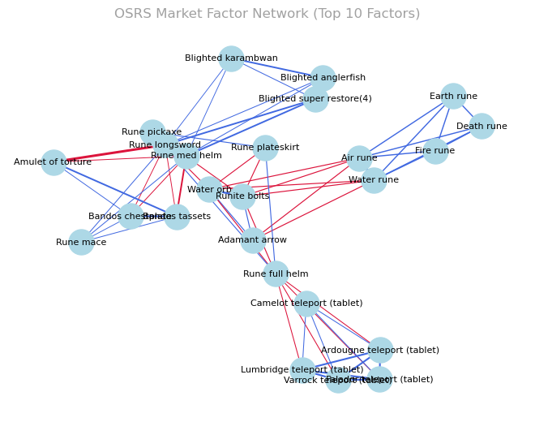
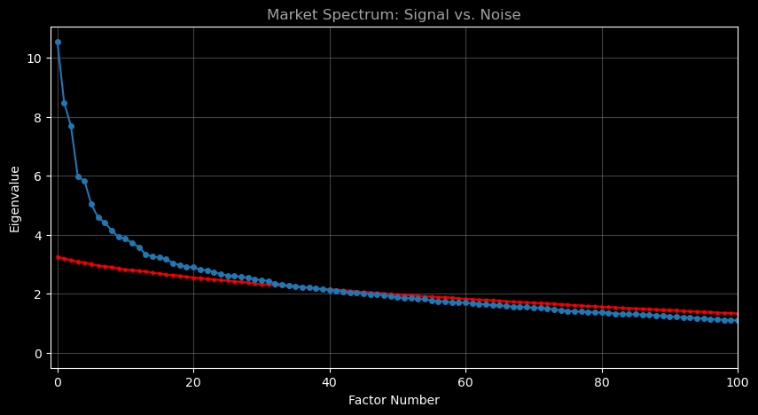
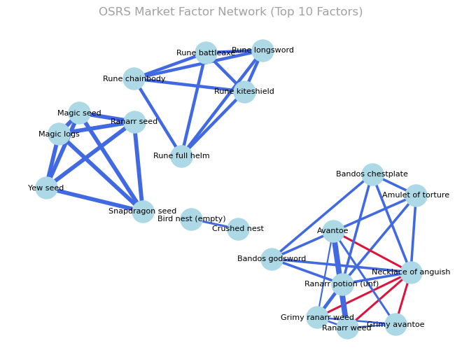

# An Analysis of the Runescape Virtual Economy
> *Michael Stavreff,*
> *December 17, 2025*
## Introduction
Old School Runescape (OSRS) is an online massively multiplayer videogame created released in its current form in February, 2013. The game boasts significant activity, peaking at over 250,000 players[^1] as of this year. Apart from its long-form repetitive "grinding" playstyle which attracts players to log many hours to the game, Runescape's main unique trait is an extremely well developed in-game economy.

### The Grand Exchange
The Grand Exchange (GE) is the centralized and go-to location to conduct trade and commerce in Runescape, representing a physical location in the world where players flock to buy, sell, and bank their items alongside some peer-to-peer trading. The buying and selling system in the GE is facilitated by a built-in marketplace system which operates on a simple order book system. Here lies the most crucial and challenging details when motivating analysis of Runescape's markets: the GE order book not transparent, yet best prices are readily presented and made available for fetching by API. 

Market activity varies significantly by item: among the game's approximately 4,500 tradeable items, prices range from 4 gold pieces (GP, currency) to multiple billion. Likewise, volumes on illiquid items range from weeks between transactions for obscure items to high frequency commodities trading 130 million+ per day.

Certain elements of the GE's market system remain unknown, such as priorities in filling same-price orders made in quick succession and exact pricing algorithms for the observed in-game price. Additionally, volume data is available via API which begins to at least make partial analysis possible. The GE levies a 2% tax on all transations conducted, rounded down to the nearest GP and capped at a limit of 5 million per transaction. A final interesting note is that developers regularly use the tax revenue to buy items from the market and delete them, providing an item sink and deflationary measure since the underlying source of creating new items is essentially unlimited apart from time spent playing.

*In the following paper*, we set out to investigate the OSRS market by characterizing its macroeconomic behavior, draw parallels to the real world, investigate where it differs, and model price movements in an informative way. The analysis is done via python API scraping[^2] and then processed further. Attempts to implement basic options pricing in C++ was explored; these will not be discussed due to their incompleteness and broadening the scope of the project. If you're interested in the code for a simple C++ binomial options model, the code is available in the repository.

[^1]: Botting development has a rich history in Runescape, something which undoubtably massively inflates real-time player counts. To be discussed later.
[^2]: Special thanks to Kiril Ivanov for early contributions to API scraping.
## Dataset and Scope of Analysis
Retrieving the data needed for the project is sourced directly from an API hosted by developers for users to develop applications or conduct analysis. Additionally, update annoucement dates was made available from the official website using simple web text-scraping.
 
This project focuses on longer-term trends, since HFT-esque strategies are not allowed in game due to a prohibition of automated botting or scripting. The decision to ultimately pivot away from constructing a trading strategy was informed by this, however certain baseline findings from implementations of models will be discussed. 

API records are accesible at any instant, however 5 minute intervals were archived for permanent access. In total, viewable market data extends to approximately March, 2015, providing over a decade of usable data. For analysis, we used 5-minute volumea and price data dating from January 29th to May 11th. Some limitations involved with this are simply storing and processing the data: across 326 remaining items indexed after filtering items which did not report a price at least 99% of 5-minute intervals, this reduced filesize from 6.4GB to 1.1GB. Working with larger filesizes consistently slowed down progress, something partially limited by the way the codebase was constructed. In the future, moving towards proper databasing methods would prevent larger datasets from needing to be held continuously in memory. 

We start the analysis by characterizing some macroeconomic trends.
## Economy at a Glance
### Alchemy
Runescape's economy is partly governed by "alchemy" prices, shorthand for an mechanic allowing players to convert items into pre-determined quantities of GP. Alchemy prices provide an absolute price floor for most items, and are irrelevant for typically more expensive items whose market value far exceed their alchemy price. However, low-value, high-frequency items on the market exhibit can interesting activity around alchemy prices. Many items float around alchemy prices, even dropping below alchemy prices in what can be characterized as a "soft" price floor. The natural explanation is that low-value items must be converted one-by-one manually to currency, providing an extremely time-intensive, low return source of guaranteed profit. For those who choose to evade the game's bot detection systems, this method provides substantial returns across many automated accounts, and is in part an underlying mechanism to keep prices above the alchemy threshold for margins worth arbitraging away. 

### Return Behavior
Numerous difficulties arise in trying to present returns of the Runescape, of which we outline their effects and possible solutions. Below is a series of log-return distributions of our 326-item sample which was further filterd to 239 to discard low-value, high-frequency items. The primary reason this is crucial is due to the GE's (and overall game's) inherent discretization of prices. Items which fluctuate around a few GP in price and steadily oscillate between a single GP price change represent massive relative returns.

*log return distributions (log scaled)*

 Furthermore, in attempting to represent return distributions, both a equal-weighted market index and volume-weighted market index exhibited massive tails. Primarily, automated trading bots are observed to constantly spike item prices through massive buying efforts and dumps, an effect visible on almost every item time series. As expected however, such irregularities smooth out over aggregation to larger timeframes along with a more Gaussian curve taking shape. 

 We also observe substantial autocorrelation in the market, which is quite easy to observe in the cyclical price movements aligned with North American day/night cycles.

As we observe, market movements take multiple hours for price correlations to decay, suggesting highly effective momentum-based strategies if automated trading were permitted. 

### PCA Analysis of Market Structure
We conducted a PCA analysis of the market correlations using the original 326-item correlation matrix. By using robust[^3] PCA techniques to decompose the price data into a sparse outlier matrix, we use the cleaned matrix for PCA. Particularly, this may be warranted working on shorter time-frames where prices are subject to extreme spikes from botting activity or sudden dumps of items on the market. 

[^3]: Robust PCA implementation can be found at https://github.com/dganguli/robust-pca.

Decomposing the cleaned matrix and sorting eigenvalues, we construct the spectrum chart given below for 5-minute data. To ensure a reliable null for significant eigenvalue-eigenvector pairs, we performed multiple permutations of time series data and similarly decomposed their correlation matrices to create a baseline floor of "noise" which we can compare against; the red datapoint correspond with 50 random permutations plotted on top of each other. It is worth noting the noise floor looks especially "tight" as if a single line given the extremely large sample relative to dimension (29,000:326). Finally, we consult the previous observations in the ACF plot and perform shuffling in 4-hour blocks to preserve autocorreltion in the data. This approach is superior, albeit more computationally intensive, to a deterministic null given by a Marchenko Pastur distribution of random matrix eigenvalues since we may drop any i.i.d or homoskedasticity assumptions. Rotation of principal components may be done generally for interpretation, but such techniques fail with small noisy signals as in our case and are generally unecessary.

| **Factor 1:** |            | **Factor 2:**  |            |
| :------------ | :--------- | :------------- | :--------- |
| **Item Name** | **Weight** | **Item Name**  | **Weight** |
| Air rune      | 0.3640     | Runite bolts   | -0.5110    |
| Water rune    | 0.3568     | Water orb      | -0.4740    |
| Fire rune     | 0.3440     | Air rune       | 0.1873     |
| Earth rune    | 0.3326     | Water rune     | 0.1812     |
| Death rune    | 0.2521     | Adamant arrow  | -0.1750    |
| Chaos rune    | 0.2256     | Earth rune     | 0.1677     |
| Cosmic rune   | 0.2144     | Fire rune      | 0.1638     |
| Nature rune   | 0.2132     | Rune arrow     | -0.1609    |
| Soul rune     | 0.2131     | Adamant dart   | -0.1554    |
| Law rune      | 0.2104     | Rune platelegs | -0.1554    |

---

| **Factor 3:**   |            | **Factor 4:**               |            |
| :-------------- | :--------- | :-------------------------- | :--------- |
| **Item Name**   | **Weight** | **Item Name**               | **Weight** |
| Water orb       | 0.4287     | Falador teleport (tablet)   | 0.2886     |
| Runite bolts    | 0.4124     | Ardougne teleport (tablet)  | 0.2604     |
| Rune full helm  | -0.2403    | Varrock teleport (tablet)   | 0.2398     |
| Rune plateskirt | -0.2314    | Lumbridge teleport (tablet) | 0.2382     |
| Rune pickaxe    | -0.2207    | Rune full helm              | -0.1984    |
| Rune platelegs  | -0.2173    | Rune plateskirt             | -0.1951    |
| Rune chainbody  | -0.1923    | Camelot teleport (tablet)   | 0.1817     |
| Rune platebody  | -0.1759    | Rune platelegs              | -0.1737    |
| Adamant dart    | 0.1614     | Rune chainbody              | -0.1728    |
| Air rune        | 0.1420     | Saradomin brew(4)           | 0.1685     |

---

| **Factor 5:**               |            | **Factor 6:**             |            |
| :-------------------------- | :--------- | :------------------------ | :--------- |
| **Item Name**               | **Weight** | **Item Name**             | **Weight** |
| Falador teleport (tablet)   | 0.3449     | Blighted anglerfish       | 0.2241     |
| Lumbridge teleport (tablet) | 0.3189     | Blighted karambwan        | 0.2037     |
| Ardougne teleport (tablet)  | 0.3123     | Rune longsword            | 0.1956     |
| Varrock teleport (tablet)   | 0.2904     | Rune med helm             | 0.1847     |
| Camelot teleport (tablet)   | 0.2320     | Blighted super restore(4) | 0.1725     |
| Soul rune                   | -0.1875    | Ranging potion(4)         | 0.1599     |
| Rune longsword              | 0.1855     | Blighted manta ray        | 0.1575     |
| Rune platelegs              | 0.1534     | Saradomin brew(4)         | 0.1555     |
| Death rune                  | -0.1430    | Super combat potion(4)    | 0.1522     |
| Chaos rune                  | -0.1327    | Stamina potion(4)         | 0.1506     |

---

| **Factor 7:**      |            | **Factor 8:**     |            |
| :----------------- | :--------- | :---------------- | :--------- |
| **Item Name**      | **Weight** | **Item Name**     | **Weight** |
| Bandos tassets     | -0.5213    | Rune longsword    | -0.3363    |
| Bandos chestplate  | -0.5197    | Rune med helm     | -0.2890    |
| Rune longsword     | 0.1636     | Bandos chestplate | -0.2881    |
| Rune med helm      | 0.1589     | Bandos tassets    | -0.2856    |
| Amulet of torture  | -0.1554    | Rune mace         | -0.2709    |
| Rune plateskirt    | -0.1236    | Rune plateskirt   | 0.2079     |
| Rune mace          | 0.1229     | Rune battleaxe    | -0.2029    |
| Blighted karambwan | 0.1182     | Rune warhammer    | -0.1781    |
| Rune warhammer     | 0.1116     | Rune full helm    | 0.1739     |
| Soul rune          | 0.0991     | Rune pickaxe      | 0.1498     |

At short timeframes, we unsurprisingly find an extremely fragmented economy with weak correlations among clusters of high volume items. The largest eigenvalue consisted of all runes as top eigenvector loadings, items which consist of the highest frequency of trade and necessary for vast swaths of gameplay and in massive supply. Additionally, teleport items and other consumables were very present in top factors, but stretched across multiple eigenvectors. Despite this, factors 7 and 8 had much more clear armor categories, specifically corresponding with loot drops from popular high-activity enemies in-game. 

Notably, eigenvectors had consistent overlaps with unique correlations between consecutive eigenvalues, showing that there exists "bridges" between clusters of commodities and possible causal relationships. A simple example of such causal links would be negative correlations between consumables and certain equipment or runes associated with enemy loot, as players restock their equipment at the market and then sell the dropped loot, causing the inversion of price movements.

Since these results lack any strong, generalizable "market" or "beta" factor, we shall aggregate to daily timeframes using historical data:

Similarly, despite a concentration of principal component variances, we do not observe any particular dominant market factor:

| **Factor 1:**   |            | **Factor 2:**       |            |
| :-------------- | :--------- | :------------------ | :--------- |
| **Item Name**   | **Weight** | **Item Name**       | **Weight** |
| Snapdragon seed | 0.1586     | Rune chainbody      | 0.2094     |
| Yew seed        | 0.1431     | Rune battleaxe      | 0.1991     |
| Magic seed      | 0.1398     | Rune full helm      | 0.1985     |
| Ranarr seed     | 0.1338     | Rune longsword      | 0.1916     |
| Magic logs      | 0.1334     | Rune kiteshield     | 0.1756     |
| Palm tree seed  | 0.1330     | Rune platebody      | 0.1665     |
| Torstol seed    | 0.1194     | Rune warhammer      | 0.1613     |
| Dragon bones    | 0.1163     | Rune pickaxe        | 0.1611     |
| Gold ore        | 0.1159     | Amulet of torture   | -0.1604    |
| Grimy irit leaf | 0.1123     | Necklace of anguish | -0.1534    |

---

| **Factor 3:**       |            | **Factor 4:**       |            |
| :------------------ | :--------- | :------------------ | :--------- |
| **Item Name**       | **Weight** | **Item Name**       | **Weight** |
| Amulet of torture   | -0.1542    | Grimy ranarr weed   | 0.1855     |
| Necklace of anguish | -0.1519    | Ranarr weed         | 0.1772     |
| Bandos godsword     | -0.1402    | Grimy avantoe       | 0.1527     |
| Ranarr potion (unf) | -0.1394    | Necklace of anguish | -0.1449    |
| Bandos chestplate   | -0.1380    | Avantoe             | 0.1434     |
| Rune platebody      | -0.1377    | Amulet of torture   | -0.1364    |
| Prayer potion(4)    | -0.1355    | Sunfire splinters   | -0.1335    |
| Rune chainbody      | -0.1301    | Ranarr potion (unf) | 0.1324     |
| Rune kiteshield     | -0.1298    | Coal                | 0.1307     |
| Bandos tassets      | -0.1297    | Prayer potion(4)    | 0.1208     |

---

| **Factor 5:**       |            |
| :------------------ | :--------- |
| **Item Name**       | **Weight** |
| Grimy ranarr weed   | 0.2158     |
| Ranarr weed         | 0.2038     |
| Ranarr potion (unf) | 0.1995     |
| Avantoe seed        | -0.1752    |
| Oak plank           | 0.1712     |
| Cadantine seed      | -0.1602    |
| Air orb             | 0.1532     |
| Grimy snapdragon    | 0.1446     |
| Snapdragon          | 0.1420     |
| Coal                | -0.1298    |

These results are surprisingly highly interpretable, and confirms the theory that Runescape's market is highly fragmented. Despite this, clear sectors drive the market albeit with small influences. In particular, market activity mainly revolves around skill training, player-versus-player combat, and boss-fighting combat gameplay loops. This is evidenced by factors relating with seed trade (farming skills), boss drops (armor sets and tools), and consumables, likely in support of previously described sectors. Given such clear clustering along with causal reasoning, this motivates strategies involving cointegration, pairs-trading, and a method of short-selling by trading negatively-correlated commodities.

## Conclusion 
Overall, rudimentary examination of Runescape's market suggests quite strong inefficiencies. Trading on such inefficiencies is impractical: buy/sell orders are limited to 8 slots, preventing holding a diverse book. Additionally, all items have a unique buy limit resetting every 4 hours. Theoretically, such limitations can be circumvented using a network of bots and pooling resources to hold positions, a practice which is plentiful in use currently for players in violation of the rules. 

While PCA captures linear relationships in items, a significant manifestation of Runescape's inefficiencies and price autocorrelation simply stems from day/night cycles as mentioned previously. Other non-linear trends may exist, however these are beyond the scope of simple PCA methods; a likely source of such relationships is sudden economic shocks from updates to the game: new items are introduced or older items are rebalanced and players flock to markets in high quantity to trade on new opportunities or otherwise consume new content being sold.
